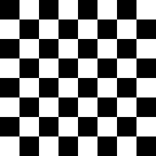
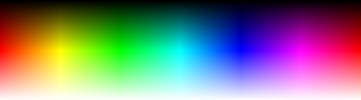
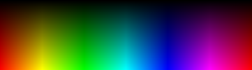

# stumpy_core

[Documentation](https://docs.leonrische.me/stumpy_core/)

## Usage

This library is not very useful on its own
but there are a few other libraries
that allow creating a canvas from an image file
or saving one to an image file.

* <https://github.com/stumpycr/stumpy_png>
* <https://github.com/stumpycr/stumpy_gif>

```crystal
require "stumpy_core"

include StumpyCore

rainbow = Canvas.new(256, 256)
(0...255).each do |x|
  (0...255).each do |y|
    # RGBA.from_rgb_n(values, bit_depth) is an internal helper method
    # that creates an RGBA object from a rgb triplet with a given bit depth
    color = RGBA.from_rgb_n(x, y, 255, 8)
    rainbow[x, y] = color
  end
end

# It is also possible to provide a background color,
# the default is transparent black `RGBA.new(0, 0, 0, 0)`
white = Canvas.new(256, 256, RGBA.from_hex("#ffffff"))

# If the colors for all pixels are already known when creating the canvas,
# the block syntax can be used to simplify the code:

rainbow2 = Canvas.new(256, 256) { |x, y| RGBA.from_rgb_n(x, y, 255, 8) }

checkerboard = Canvas.new(256, 256) do |x, y|
  if ((x / 32) + (y / 32)).odd?
    RGBA.from_hex("#ffffff")
  else
    RGBA.from_hex("#000000")
  end
end

spectrum  = Canvas.new(361, 101) { |x, y| RGBA.from_hsl(x, 100, y) }
spectrum2 = Canvas.new(361, 101) { |x, y| RGBA.from_hsba([x, 100, y], 1) }
```






## Contributors

Thanks goes to these wonderful people ([emoji key](https://github.com/kentcdodds/all-contributors#emoji-key)):

<!-- ALL-CONTRIBUTORS-LIST:START - Do not remove or modify this section -->
<!-- prettier-ignore -->
| [<br /><sub><b>Leon</b></sub>](https://github.com/l3kn)<br />[💻](https://github.com/l3kn/stumpy_core/commits?author=l3kn "Code") | [<br /><sub><b>Ian Rash</b></sub>](http://broken-kami.tumblr.com)<br />[💻](https://github.com/l3kn/stumpy_core/commits?author=redcodefinal "Code") | [<br /><sub><b>Sam</b></sub>](https://github.com/Demonstrandum)<br />[💻](https://github.com/l3kn/stumpy_core/commits?author=Demonstrandum "Code") | [<br /><sub><b>reiswindy</b></sub>](https://github.com/reiswindy)<br />[📖](https://github.com/l3kn/stumpy_core/commits?author=reiswindy "Documentation") |
| :---: | :---: | :---: | :---: |
<!-- ALL-CONTRIBUTORS-LIST:END -->

This project follows the [all-contributors](https://github.com/kentcdodds/all-contributors) specification. Contributions of any kind welcome!
